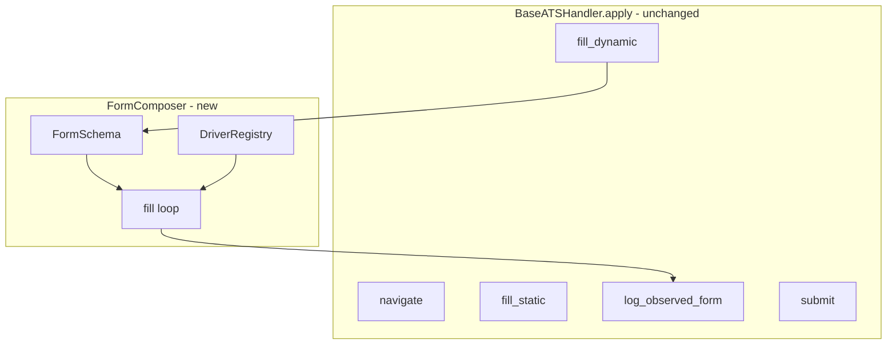
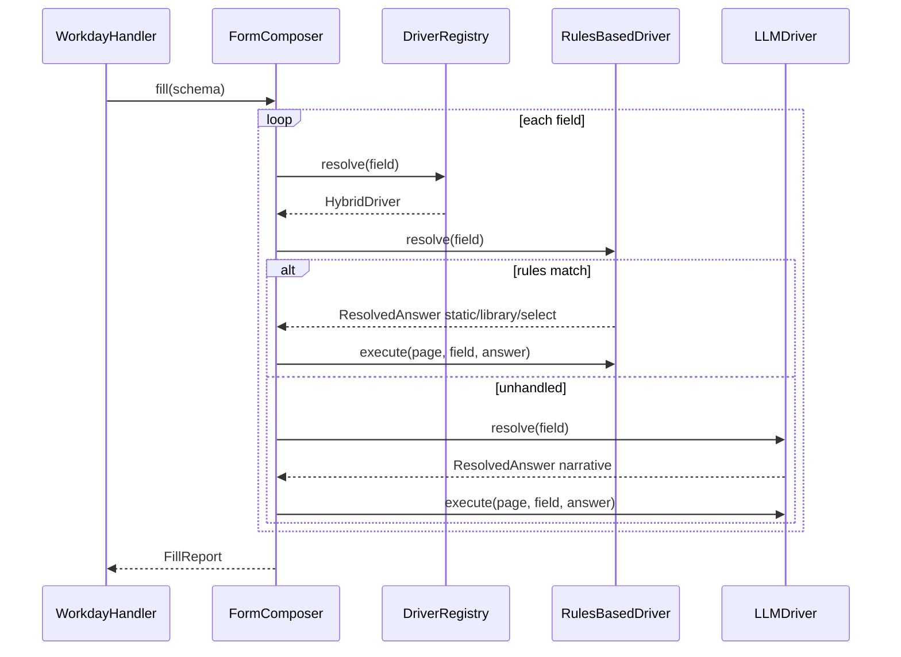

# MagicApply — Composable Forms Architecture

**Version:** 1.0  
**Date:** July 6, 2026  
**Status:** Shipped on `feature/composable-forms-refactor` (extends [`ARCHITECTURE.md`](ARCHITECTURE.md))  
**Author:** Geoffrey / MagicApply contributors

**Related documents:**
- [`ARCHITECTURE.md`](ARCHITECTURE.md) — layered architecture (unchanged as the structural backbone)
- [`final_dod_plan.md`](final_dod_plan.md) — Phase 1 workflow and DoD (updated in §6 below)
- [`docs/GOF_PATTERNS.md`](docs/GOF_PATTERNS.md) — extend-don't-multiply meta-principle
- [`docs/AI_HANDOFF.md`](docs/AI_HANDOFF.md) — VM topology and operator constraints

---

## 1. Motivation: from brittle branching to composable forms

### 1.1 What works today

MagicApply already ships an end-to-end pipeline: discover → tailor → apply across four ATS handlers. Form filling for per-role custom fields flows through three cooperating modules:

| Module | Location | Role |
|--------|----------|------|
| `scan_form` | [`form_scan.py`](src/magicapply/infrastructure/browser/ats/form_scan.py) | DOM → `FormField` list |
| `AnswerRouter` | [`answer_router.py`](src/magicapply/infrastructure/browser/ats/answer_router.py) | Label/kind → `ResolvedAnswer` strategy |
| `apply_router_to_form` | [`router_dispatch.py`](src/magicapply/infrastructure/browser/ats/router_dispatch.py) | Scan loop + Playwright dispatch |

Greenhouse uses this path almost exclusively. Workday layers **additional imperative fill functions** (`_fill_workday_widgets`, `_fill_workday_experience`, `_fill_workday_voluntary_disclosures`, etc.) because Workday React widgets do not map cleanly to `page.fill()` on scanned selectors.

### 1.2 Why this is brittle

Real ATS verification (W.4) exposed recurring failure modes:

1. **Handler-owned branching grows without bound.** Each new employer quirk adds another `_fill_workday_*` function or widens regex tables in `AnswerRouter`. Logic is scattered across handler files, router tiers, and widget helpers with no single composition model. *(Router regex tables now live in `router_rules.yaml` — see §2.6; adding a new employer quirk is a YAML edit, no code change.)*

2. **Scan output and fill logic are decoupled.** `FormField` describes *what* was found; handlers decide *how* to fill via parallel code paths. The observation log records resolutions, but there is no schema that says "this step has these fields in this order with these drivers."

3. **Rules and LLM are fused in one imperative method.** `AnswerRouter.resolve()` is a six-tier imperative chain (static → library → yes/no → DEI → narrative → unhandled). The CoR-threshold note in `answer_router.py` acknowledges this will not scale — but a full Chain of Responsibility with seven sibling classes would violate extend-don't-multiply.

4. **Widget fields are special-cased by regex.** `_HANDLER_OWNED_WIDGET_PATTERNS` marks fields the router must skip. This prevents corruption (e.g., `page.fill()` on a Workday multiselect) but encodes ATS knowledge as negative regex guards rather than explicit field typing. *(Partly addressed: `router_rules.yaml::handler_owned_variants` skips by variant first; the `handler_owned_widget` regex list remains as belt-and-braces for scan-derived fields whose variant hasn't been enriched. Fully removing the regex list waits on `form_scan.py` variant coverage for every widget shape.)*

5. **Regression risk on multi-step wizards.** Workday's wizard loop re-scans and re-fills each step. Without idempotent "already filled" checks per field, the same step can be retried six times (observed on Self Identify date spinbuttons) while logging identical unhandled fields.

### 1.3 What composable forms solve

A **composable form system** treats each application step as:

```
FormSchema  =  ordered list of typed FormFields + fill metadata
FormComposer  =  scan and/or load schema → pick driver per field → execute → log
FormFieldDriver  =  pluggable resolution + Playwright interaction strategy
```

Benefits:

- **One orchestration path** replaces `apply_router_to_form` + ad-hoc handler fill calls over time.
- **Explicit field typing** (TextInput, Dropdown, WorkdayListbox, etc.) routes to the correct Playwright primitive.
- **Runtime driver swap** (rules vs LLM vs hybrid) is config-driven, not a code change.
- **Migration complete (C.0–C.6)** — all handlers use `FormComposer`; legacy imperative fallbacks removed. Remaining Workday imperative code (`_fill_workday_widgets`, experience, questionnaire) is the next recipe migration target.

This document does **not** replace the layered architecture. It refines the **infrastructure/browser/forms/** concern inside the existing Strategy + Template Method stack.

---

## 2. New abstractions

### 2.1 Design principle: extend, don't multiply

| Question | Answer for composable forms |
|----------|----------------------------|
| New `FormField` class? | **Extend** the existing [`FormField`](src/magicapply/infrastructure/browser/ats/form_scan.py) dataclass with a `variant` discriminator and optional typed payloads — do not create a parallel `ScannedField` hierarchy. |
| New router class? | **Wrap** `AnswerRouter` as `RulesBasedDriver` — same regex tables, new Protocol surface. |
| New dispatch loop? | **Evolve** `apply_router_to_form` into `FormComposer.fill()` — old function becomes a thin delegate during migration. |
| New ATS handler? | **No.** Handlers produce `FormSchema` fragments or call `FormComposer`; `BaseATSHandler.apply` Template Method is unchanged. |

Abstractions introduced (minimal set):

1. `FormField` variants (tagged extension of existing type)
2. `FormSchema`
3. `FormComposer`
4. `FormFieldDriver` Protocol + three implementations

No separate `FormScanner`, `FormFiller`, `FormValidator`, or `DriverFactory` classes unless a fourth migration phase proves they earn their place.

### 2.2 FormField and variants

The existing `FormField` dataclass remains the **canonical field record** in observation logs (`form.yaml`). We extend it:

```python
# Proposed location: src/magicapply/infrastructure/browser/forms/fields.py
# (re-export from form_scan.py for backward compatibility)

FieldVariant = Literal[
    "text",           # → TextInput
    "textarea",       # → TextArea
    "select",         # → Dropdown (native <select>)
    "checkbox",       # → Checkbox
    "radio",          # → RadioGroup
    "file",           # → FileUpload
    "workday_listbox",    # → WorkdayListbox (button + portal options)
    "workday_multiselect", # → WorkdayMultiselect (promptOption cascade)
    "workday_date_spin",   # → DateSpinGroup (MM/DD/YYYY spinbuttons)
]

@dataclass
class FormField:
    selector: str
    label: str
    kind: FieldKind          # existing: text | textarea | select | checkbox | radio | file
    variant: FieldVariant    # NEW — defaults from kind via mapping table
    name: str | None = None
    options: list[str] = field(default_factory=list)
    required: bool = False
    # NEW — composition metadata (optional)
    step_id: str | None = None       # e.g. "my_information", "voluntary_disclosures"
    driver_hint: str | None = None   # override from config: "rules" | "llm" | "hybrid" | "handler"
    widget_id: str | None = None     # Workday: button id or fkit_id
    group_id: str | None = None      # radio groups, date spin groups
```

**Variant mapping (scan time):**

| Scanned `kind` | Default `variant` | Notes |
|----------------|-------------------|-------|
| `text` | `text` | Includes email, tel, password |
| `textarea` | `textarea` | |
| `select` | `select` | Native HTML select |
| `checkbox` | `checkbox` | |
| `radio` | `radio` | Collapsed group (existing behavior) |
| `file` | `file` | Resume upload |

**ATS-specific variants** are assigned by **schema builders**, not the generic DOM scanner:

- `workday_listbox` — `button[aria-haspopup='listbox']` + `#personalInfoUS--veteranStatus`
- `workday_multiselect` — `[data-automation-id='multiSelectContainer']` under `[data-fkit-id='…']`
- `workday_date_spin` — `#selfIdentifiedDisabilityData--dateSignedOn-dateSection{Month,Day,Year}-input`

Existing [`workday_widgets.py`](src/magicapply/infrastructure/browser/ats/workday_widgets.py) functions become **variant executors** invoked by `FormComposer`, not parallel fill paths.

### 2.3 FormSchema

A `FormSchema` is an ordered, fillable description of one wizard step or one inline form:

```python
@dataclass
class FormSchema:
    schema_id: str              # e.g. "greenhouse_application", "workday_voluntary_disclosures"
    ats: str                    # "greenhouse" | "workday" | "lever" | "ashby"
    step_id: str | None         # wizard step landmark, if any
    fields: list[FormField]     # fill order matters for dependent widgets
    form_selector: str          # DOM scope for scan validation / re-scan
    source: Literal["scanned", "recipe", "hybrid"]
```

**Composition sources:**

| `source` | How built | Used by |
|----------|-----------|---------|
| `scanned` | `scan_form(page, form_selector)` + variant inference | Greenhouse, Lever, Ashby (inline forms) |
| `recipe` | Handler-authored field list (no live scan) | Workday widget steps where scan is unreliable |
| `hybrid` | Recipe skeleton merged with scan (labels/selectors refreshed from DOM) | Workday steps transitioning to full scan |

**FormSchema registry (config, optional):**

```yaml
# configs/form_schemas.yaml (proposed, Phase 2+)
schemas:
  workday_voluntary_disclosures:
    ats: workday
    step_id: voluntary_disclosures
    fields:
      - label_pattern: "Ethnicity"
        variant: workday_listbox
        widget_id: personalInfoUS--ethnicity
        driver_hint: rules
      - label_pattern: "Veteran"
        variant: workday_listbox
        widget_id: personalInfoUS--veteranStatus
        driver_hint: rules
```

Recipes live in config only when stable across tenants; employer-specific quirks stay as handler module constants until promoted.

### 2.4 FormComposer

`FormComposer` is the **single orchestrator** for typed field filling. It replaces the implicit contract of `apply_router_to_form` + scattered handler calls.

```python
class FormComposer:
    def __init__(
        self,
        *,
        drivers: DriverRegistry,
        page: PageDriver,
        data: ApplicationData,
    ) -> None: ...

    def fill(self, schema: FormSchema) -> FillReport:
        """For each field in schema.fields:
        1. Skip if already_filled(field) (idempotent)
        2. driver = drivers.resolve(field, data)
        3. resolved = driver.resolve(field, data.job)
        4. driver.execute(page, field, resolved)  # variant-aware Playwright
        5. append to data.resolutions_log
        Return FillReport(unhandled, errors, skipped)
        """

    def fill_scanned(self, form_selector: str, *, ats: str, step_id: str | None = None) -> FillReport:
        """Convenience: scan → FormSchema(source='scanned') → fill()"""

    def fill_recipe(self, recipe: FormSchema) -> FillReport:
        """Convenience: validate visibility → fill()"""
```

**Relationship to Template Method:**

`BaseATSHandler.apply` still owns CAPTCHA checks, dry-run short-circuit, observation log write, and submit. Handlers call `FormComposer` inside `_fill_dynamic` — same hook, clearer interior.



### 2.5 FormFieldDriver Protocol

```python
class FormFieldDriver(Protocol):
    def resolve(self, field: FormField, job: Job) -> ResolvedAnswer: ...
    def execute(self, page: PageDriver, field: FormField, answer: ResolvedAnswer) -> bool: ...
    def supports(self, field: FormField) -> bool: ...
```

**ResolvedAnswer** and **Strategy** literals are unchanged — observation logs and `answer_library.yaml` promotion workflow stay compatible.

#### RulesBasedDriver

- **Wraps** existing [`AnswerRouter`](src/magicapply/infrastructure/browser/ats/answer_router.py) for `resolve()`.
- **Owns** variant-aware `execute()`:
  - `text` / `textarea` → `page.fill`
  - `select` / `radio` → `page.select_option` / radio click
  - `checkbox` → `page.check`
  - `file` → skip (handler already uploaded) or `set_input_files`
  - `workday_*` variants → delegate to `workday_widgets` functions

This moves Playwright dispatch **out of** `router_dispatch.py` into the driver, colocating resolution and execution per variant.

#### LLMDriver

- `resolve()` — calls `NarrativeEngine.answer(job, field.label)` for open-ended text not handled by rules.
- `execute()` — `page.fill` on text/textarea variants only.
- `supports()` — `field.variant in {"text", "textarea"}` and field not matched by rules pre-check.

LLM prompts remain in [`configs/prompts.yaml`](configs/prompts.yaml). Phase 1 continues to use `provider: mock`; LLMDriver does not change the LLM Protocol.

#### HybridDriver

- **Not a third resolution engine.** A thin composite:
  1. Try `RulesBasedDriver.resolve()` — if strategy != `unhandled`, use it.
  2. Else try `LLMDriver.resolve()`.
  3. Else `unhandled`.

This is the default driver for narrative-tier fields without forking `AnswerRouter.resolve()`.

### 2.6 Driver selection (config, per-ATS, per-field)

```python
@dataclass
class DriverRegistry:
    default: FormFieldDriver          # usually HybridDriver
    by_ats: dict[str, FormFieldDriver]
    by_variant: dict[FieldVariant, FormFieldDriver]
    by_label_regex: list[tuple[re.Pattern, FormFieldDriver]]
```

**Config surface** (extends [`base_config.yaml`](configs/base_config.example.yaml)):

```yaml
form_drivers:
  default: hybrid
  ats:
    greenhouse: hybrid
    workday: rules          # widgets are handler-recipe; LLM rarely needed mid-wizard
  variants:
    workday_listbox: rules
    workday_multiselect: rules
    workday_date_spin: rules
  fields:
    - label_regex: "why do you want"
      driver: llm
    - label_regex: "describe your experience"
      driver: llm
```

**Runtime resolution order:**

1. `field.driver_hint` (from recipe)
2. `form_drivers.fields[]` label_regex match
3. `form_drivers.variants[variant]`
4. `form_drivers.ats[ats]`
5. `form_drivers.default`

**Composition root** ([`cli/composition.py`](src/magicapply/cli/composition.py)) builds `DriverRegistry` + `FormComposer` alongside `AnswerRouter` and injects into `ApplicationData` (new optional field `form_composer`).

**Sister config layer — router rules.** `RouterRules` at [`src/magicapply/config/router_rules.py`](src/magicapply/config/router_rules.py) is the second config-driven regex layer alongside the driver registry: identity, yes-no, DEI, consent, optional-checkbox, SMS opt-in, and handler-owned label/variant lists all load from [`src/magicapply/infrastructure/browser/ats/resources/router_rules.yaml`](src/magicapply/infrastructure/browser/ats/resources/router_rules.yaml). Injected into `AnswerRouter.__init__` the same way `AnswerLibrary` is. Operators override by dropping a file at `<config_root>/router_rules.yaml` — the loader replaces the package default wholesale (no merge; start from a copy).

---

## 3. Integration with the existing system

### 3.1 Layering (unchanged)

```
CLI → pipelines/ → domain/ → infrastructure/
```

| Layer | Change |
|-------|--------|
| `cli/` | No new commands. `composition.py` wires `FormComposer`. |
| `pipelines/` | `ApplyPipeline` unchanged. Optional: pass `use_composable_forms: bool` kwarg during migration. |
| `domain/` | **No imports from infrastructure.** `ApplicationData` may gain an opaque `form_composer: object | None` slot (same pattern as `answer_router`). |
| `infrastructure/browser/forms/` | **New package** — `fields.py`, `schema.py`, `composer.py`, `drivers/` |
| `infrastructure/browser/ats/` | Handlers slim down over time; `form_scan.py` moves or re-exports from `forms/` |

### 3.2 Static config and narrative mode

| Data source | Driver tier | Config location |
|-------------|-------------|-----------------|
| Identity, contact, DEI, work-auth | RulesBasedDriver → static tier | `configs/base_config.yaml` → `static_answers` |
| Verified screening Q&A | RulesBasedDriver → library tier | `configs/answer_library.yaml` |
| Open-ended questions | HybridDriver → LLMDriver | `configs/prompts.yaml` + `NarrativeEngine` |
| Resume file | RulesBasedDriver → file tier | `data/tailored/<app_id>/resume.docx` |

The answer-library growth workflow (W.3) is unchanged: unhandled → `data/answer_proposals.yaml` → operator promotion → `answer_library.yaml`.

### 3.3 Per-ATS handler integration

**Greenhouse (target first migration):**

```python
def _fill_dynamic(self, page, data):
    # resume upload unchanged
    composer = data.form_composer
    if composer:
        composer.fill_scanned("form#application-form", ats="greenhouse")
    else:
        apply_router_to_form(page, data, handler_name="Greenhouse")  # legacy
```

**Workday (second migration):**

Wizard loop becomes:

```python
for step in _workday_steps(page):
    schema = _workday_schema_for_step(step, page)  # recipe or hybrid
    composer.fill(schema)
    click_next()
```

Existing functions (`_fill_workday_voluntary_disclosures`, etc.) become **recipe builders** that return `FormSchema` until fully absorbed.

### 3.4 Rules vs LLM swapping at runtime



Operator can force rules-only for an ATS (`form_drivers.ats.workday: rules`) without code deploy — important for Phase 1 mock-LLM discipline.

### 3.5 Updated high-level architecture

```mermaid
flowchart TB
    subgraph cli [CLI Layer]
        Commands[Typer commands]
        Comp[composition.py]
    end

    subgraph pipelines [Pipeline Layer]
        Disc[DiscoveryPipeline]
        Tail[TailoringPipeline]
        Apply[ApplyPipeline]
    end

    subgraph domain [Domain Layer]
        Models[Job Application Resume]
        Narrative[NarrativeEngine]
        State[Application state machine]
    end

    subgraph infra [Infrastructure Layer]
        Sources[Job sources]
        Persist[SQLite repositories]
        Session[PlaywrightSession]
        subgraph ats [ATS Strategy]
            Handlers[Greenhouse Workday Lever Ashby]
            Base[BaseATSHandler TemplateMethod]
        end
        subgraph forms [Composable Forms - NEW]
            Scan[form_scan]
            Schema[FormSchema]
            Composer[FormComposer]
            Drivers[FormFieldDriver implementations]
        end
        Obs[observed_form_log]
    end

    subgraph config [Config Layer]
        YAML[base_config prompts keyword_bank answer_library]
        FormCfg[form_drivers.yaml - NEW optional]
    end

    Commands --> Comp
    Comp --> Disc and Tail and Apply
    Apply --> Session and Handlers
    Handlers --> Base
    Handlers --> Composer
    Composer --> Schema and Drivers
    Scan --> Schema
    Drivers --> Narrative
    Base --> Obs
    Comp --> YAML and FormCfg
```

---

## 4. Impact on other layers

### 4.1 Pipelines

| Pipeline | Impact |
|----------|--------|
| `discovery.py` | None |
| `tailoring.py` | None |
| `apply.py` | None — still calls `handler.apply(page, data)`. `form_composer` wired in `composition.build_application_data`. |

### 4.2 Domain

- `Application`, `Job`, `ApplicationState` — unchanged.
- `NarrativeEngine` — consumed by `LLMDriver`; interface unchanged.
- No new domain models for forms — `FormSchema` lives in infrastructure (browser concern).

### 4.3 Infrastructure

| Component | Change |
|-----------|--------|
| `form_scan.py` | Extend `FormField`; optionally move to `forms/scan.py` with re-export |
| `answer_router.py` | Becomes resolution backend for `RulesBasedDriver`; regex tables **moved to `router_rules.yaml`** (package resource loaded via `RouterRules.load_default()`; operator override at `<config_root>/router_rules.yaml`). Router accepts `router_rules: RouterRules \| None = None` via DI. |
| `router_dispatch.py` | `fill_dynamic_fields` / `fill_composable_scanned` — requires `form_composer` (no rules-only fallback) |
| `workday_widgets.py` | Becomes execution backend for Workday variants (no API change initially) |
| `observed_form_log.py` | Add optional `variant`, `step_id` columns to `form.yaml` |
| `session.py` | Unchanged — `PageDriver` Protocol sufficient |

### 4.4 Playwright interaction

`FormComposer` centralizes variant → Playwright mapping:

| Variant | Playwright primitive |
|---------|---------------------|
| TextInput, TextArea | `page.fill` |
| Dropdown | `page.select_option` |
| Checkbox | `page.check` |
| RadioGroup | click `input[type=radio][value=…]` |
| FileUpload | `page.set_input_files` |
| WorkdayListbox | `workday_widgets.select_listbox_first_match` |
| WorkdayMultiselect | `workday_widgets.fill_multiselect` |
| DateSpinGroup | fill spinbuttons + blur; skip-if-filled guard |

Fast-fail timeouts (500 ms candidate loops, 8 s wizard clicks) preserved from existing handlers.

### 4.5 Updated GoF pattern usage

| Pattern | Before | After composable forms |
|---------|--------|------------------------|
| **Strategy** | Per-ATS handlers | Unchanged — handlers remain per-ATS |
| **Template Method** | `BaseATSHandler.apply` | Unchanged — composer called inside `_fill_dynamic` |
| **Strategy** (new) | — | `FormFieldDriver` implementations (rules / LLM / hybrid) |
| **Composite** (deferred → partial) | — | `FormSchema` as composite of `FormField` children; justified because fill order and step grouping are real tree structure |
| **Chain of Responsibility** | Deferred for AnswerRouter | **Still deferred** — `HybridDriver` is a two-step composite, not a CoR chain |
| **Factory Method** | `ATSHandlerFactory`, `build_source` | `DriverRegistry` built in composition root — registry dict, not a new factory class |

---

## 5. Migration plan

### 5.1 Principles

1. **No big-bang rewrite.** Each phase left `uv run pytest tests/unit -q` green.
2. **Greenhouse first** — simplest handler, already scan+router native.
3. **Flag removed (C.6)** — `form_composer` always wired; no `use_composable_forms` toggle.
4. **Fallbacks removed** — imperative DEI/disability fills deleted from `workday.py`; gaps filled in recipes, scan enrichment, and driver execute paths instead.

### 5.2 Phased steps

| Phase | Status | Deliverable |
|-------|--------|-------------|
| **C.0** | Done | `forms/` package; `FormField` variants; `FormSchema`; `FormComposer` + `RulesBasedDriver` |
| **C.1** | Done | `HybridDriver` + `LLMDriver`; `DriverRegistry`; wired in `composition.py` |
| **C.2** | Done | Greenhouse/Lever/Ashby `_fill_dynamic` → `fill_dynamic_fields` |
| **C.3** | Done | Workday recipe schemas (voluntary disclosures, self identify); idempotent `already_filled` |
| **C.4** | Done | Lever + Ashby composable scan path; per-ATS unit tests |
| **C.5** | Done | Capture regression fixtures in `tests/fixtures/captured/` |
| **C.6** | Done | `use_composable_forms` flag removed; legacy fallbacks deleted; `form_composer` required |

### 5.3 Backward compatibility

| Artifact | Strategy |
|----------|----------|
| `form.yaml` observation format | Additive fields only (`variant`, `step_id`); old captures remain valid |
| `AnswerRouter` public API | Frozen — `RulesBasedDriver.resolve` delegates to `router.resolve` |
| `apply_router_to_form` | Thin alias → `fill_composable_scanned` (tests only) |
| Handler-specific Workday DEI/disability fills | **Deleted** — recipes + scan enrichment replace them |
| Remaining Workday imperative (`widgets`, `experience`, `questionnaire`) | Next migration targets into recipes/schemas |
| `configs/answer_library.yaml` | Unchanged |

### 5.4 Testing approach

| Tier | Purpose |
|------|---------|
| **Unit** | `FormComposer` fill loop; driver selection; variant execute; idempotent skip; Workday variant delegation |
| **Hermetic E2E** | Greenhouse fixture — composable path reaches Submit with 0 required unhandled |
| **Live dry-run** | Each W.4 sub-phase re-run with `--no-submit`; capture `dom.html` + `screenshot.png` + `form.yaml` |
| **Regression (W.7)** | Frozen `FormSchema` from real captures; composer fills fixture HTML without Chromium network |

**Regression gate:** all existing tests pass at every phase; no submission in Phase 1 (`--no-submit` only).

---

## 6. Updated Definition of Done

Extends [`final_dod_plan.md`](final_dod_plan.md) — new rows marked **(CF)** for composable forms.

### 6.1 New workflow rows

| Phase | Status | Criterion |
|-------|--------|-----------|
| **W.3** | Done | Answer library + observation log |
| **CF.1** | Done | `FormComposer` + `RulesBasedDriver`; unit tests green |
| **CF.2** | Done | `HybridDriver` + config-driven `DriverRegistry` |
| **CF.3** | Partial | Greenhouse hermetic path verified; live W.4a apply pending |
| **CF.4** | In progress | Workday recipes ship; Circle dry-run reaches Review; Self Identify stability gate pending |
| **CF.5–CF.6** | Done | Capture regression + flag removal + fallback deletion |
| **W.4c–d** | Not started | Lever + Ashby live apply loops |
| **W.5–W.8** | Not started | Unchanged intent |

### 6.2 Updated exit criteria (W.4 loop)

Existing criterion preserved:

> Browser reaches Submit button, zero unhandled **required** fields, DOM + observed-forms captured, screenshot on disk.

Additional **(CF)** requirements:

1. `form.yaml` records `variant` for every filled field.
2. Workday widget fields use `workday_*` variants — not `unhandled` when handler recipe filled them.
3. `FormComposer` fill path used (not legacy `apply_router_to_form` direct) for the verified ATS.
4. All unit + hermetic E2E tests pass; live dry-runs use `--no-submit`.

### 6.3 Current project state (2026-07-07)

| Area | State |
|------|-------|
| W.0–W.3 | Complete on `main` |
| CF.0–CF.6 | Complete on `feature/composable-forms-refactor` (uncommitted) |
| W.4a Greenhouse | Discovery done; live apply + capture pending |
| W.4b Workday | Circle Staff DS dry-run to Review (`20260707-131006`); legacy fallbacks removed; CF.4 Self Identify stability pending |
| W.7 | Partial — `tests/fixtures/captured/` + capture regression tests |
| Next composable gaps | Workday experience/widgets/questionnaire → recipes; Circle disability checkbox + review-page scan fills |

---

## 7. Explicit non-goals (Phase 1)

- No new ATS handler classes.
- No Chain of Responsibility with per-tier sibling classes.
- No LLM Protocol changes; mock provider remains default.
- No automatic submission (`--yes-submit` stays operator-gated).
- No web review UI.
- No replacement of `InPlaceDocxTailorer` or tailoring pipeline.

---

## 8. Summary

The composable form system **extends** the existing `FormField` → `AnswerRouter` → `apply_router_to_form` pipeline into a typed, driver-based composition model orchestrated by `FormComposer`. It preserves the layered architecture, Template Method ATS flow, config-over-code philosophy, and observation-log workflow. Migration starts at Greenhouse (lowest branching), absorbs Workday widget recipes incrementally, and gates on the same W.4 dry-run captures the project already uses for DoD sign-off.

**Extend-don't-multiply audit:** four new concepts (`FormSchema`, `FormComposer`, `FormFieldDriver`, `DriverRegistry`) — each maps to a gap the current code cannot cover without continued handler branching. No parallel scanner, no duplicate router, no new ATS handlers, no CoR chain. `FormField` is extended, not replaced. `AnswerRouter` is wrapped, not rewritten.

---

**End of Document**