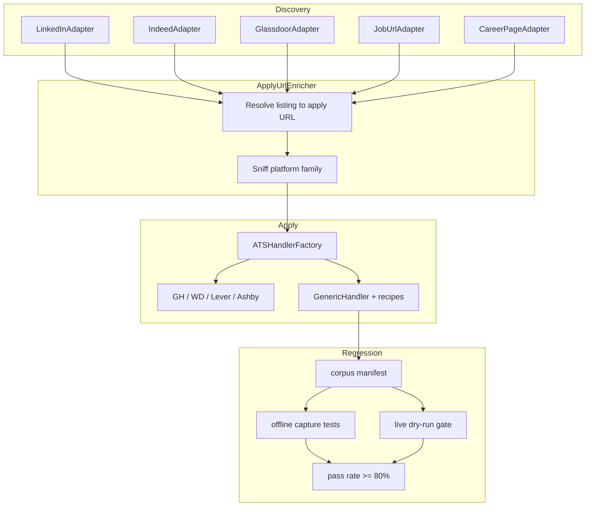
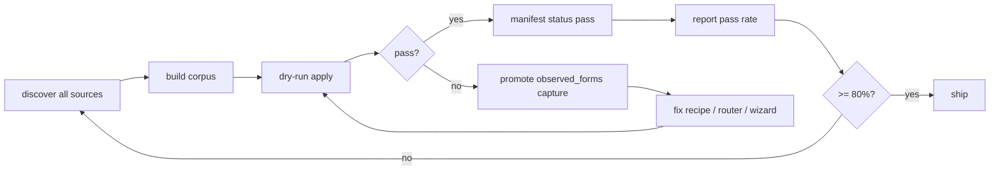

> Add apply-URL enrichment at discovery, a catch-all GenericHandler with platform recipes and family handlers, and a corpus-driven regression gate targeting 80% dry-run success on non–big-4 applications across all discovery sources.

# Custom ATS — 80% automation plan

**Status (2026-07-07):** PR1–PR6 shipped on `feature/composable-forms-refactor`. PR7 (80% gate + operator tooling) in progress.

| PR | Commit | Summary |
|----|--------|---------|
| PR1 | `14aafab` | `Job.apply_url` + DB column + factory routing |
| PR2 | `eaf293e` | LinkedIn apply-url enrichment + platform sniffing |
| PR3 | `93a96be` | `GenericHandler` catch-all + smoke fixture |
| PR4 | `514e759` | YAML `ats_recipes` loader + wizard loop + Eightfold |
| PR5 | `fd07252` | Indeed/Glassdoor/job_url enrichment + corpus builder |
| PR6 | `791c004` | Phenom, iCIMS, custom_careers, Netflix recipes + fixtures |
| PR7 | — | 80% gate + `custom-ats report` CLI + runbook |

## Goal and success metric

**Target:** At least **80%** of *custom* applications (any apply URL that does not match Greenhouse, Workhouse, Lever, or Ashby) complete a **dry-run apply** (`--no-submit`) with:

- `final_state = applied`, `dry_run = true`
- **Zero required fields** with `resolved_strategy: unhandled` in `data/observed_forms/.../form.yaml`

**Corpus (comprehensive):** All discovery sources — LinkedIn, Indeed, Glassdoor, `job_url`, `career_page`, Greenhouse boards — evaluated on the **external apply URL** after enrichment. Big-4 URLs continue to use existing handlers; everything else routes to the custom stack.

**Measurement harness:** A versioned corpus manifest + pytest gate (not a one-off manual count).



---

## Critical design constraint: job identity vs apply URL

Today [`Job.id`](src/magicapply/domain/models/job.py) is `hash(canonicalize_url(url))`. LinkedIn listings use `linkedin.com/jobs/view/...`; external apply URLs differ.

**Do not replace `job.url` with the external URL** — that would change IDs and break dedup/history.

**Add `apply_url` (optional):**

| Field | Purpose |
|-------|---------|
| `url` | Listing/canonical discovery URL (identity + dedup) |
| `apply_url` | External apply destination (handler routing + navigation) |
| `raw["platform"]` | Sniffed family: `generic`, `eightfold`, `phenom`, `icims`, … |

**Routing change** in [`ApplyPipeline.apply_one`](src/magicapply/pipelines/apply.py):

```python
handler = ATSHandlerFactory.for_url(job.apply_url or job.url)
```

**Persistence:** Add `apply_url` column to [`JobRow`](src/magicapply/infrastructure/persistence/tables.py) + repository mapping. No Alembic today — ship a one-shot `CREATE TABLE IF NOT EXISTS` migration helper in [`db.py`](src/magicapply/infrastructure/persistence/db.py) that `ALTER TABLE jobs ADD COLUMN apply_url TEXT` when missing (idempotent).

---

## Architecture: three layers (extend existing patterns)

### Layer 1 — Apply URL enrichment (discovery)

New module: [`src/magicapply/infrastructure/sources/apply_url.py`](src/magicapply/infrastructure/sources/apply_url.py)

| Resolver | Input | Output |
|----------|-------|--------|
| `decode_linkedin_safety_go(href)` | `linkedin.com/safety/go?url=...` | External URL (already proven in W.5c scratch) |
| `resolve_listing_url(session, listing_url, source)` | Any listing page | `apply_url` via source-specific rules |

**Per-source wiring:**

- **[`linkedin.py`](src/magicapply/infrastructure/sources/linkedin.py):** After Voyager card parse, optional detail fetch (rate-limited) to read `a[aria-label*='Apply']` href → decode safety redirect. Store `apply_url` + `listing_url` in `Job.raw`; set `Job.apply_url`.
- **[`indeed.py`](src/magicapply/infrastructure/sources/indeed.py) / [`glassdoor.py`](src/magicapply/infrastructure/sources/glassdoor.py):** On detail page, extract "Apply" / "Apply on company site" link (same enricher). Works when bot protection is absent; corpus includes blocked runs as `skipped` not `fail`.
- **[`custom_url.py`](src/magicapply/infrastructure/sources/custom_url.py):** If JSON-LD `JobPosting.url` differs from page URL, prefer explicit apply link in HTML.

Enrichment is **best-effort**: missing `apply_url` → fall back to `job.url` (GenericHandler still attempts catch-all).

### Layer 2 — Catch-all GenericHandler

New file: [`src/magicapply/infrastructure/browser/ats/generic.py`](src/magicapply/infrastructure/browser/ats/generic.py)

Subclass [`BaseATSHandler`](src/magicapply/infrastructure/browser/ats/base.py). Register **last** in [`factory.py`](src/magicapply/infrastructure/browser/ats/factory.py):

```python
_handler_classes = [GreenhouseHandler, WorkdayHandler, LeverHandler, AshbyHandler, GenericHandler]
```

| Hook | Behavior |
|------|----------|
| `matches(url)` | Always `True` (catch-all; only reached when big-4 miss) |
| `_navigate` | `goto(apply_url)`; run recipe `pre_steps` (click Apply, dismiss cookie banner) |
| `_fill_static` | **No hardcoded selectors** — identity via scan + [`AnswerRouter`](src/magicapply/infrastructure/browser/ats/answer_router.py) |
| `_fill_dynamic` | [`fill_dynamic_fields`](src/magicapply/infrastructure/browser/ats/router_dispatch.py) with `ats="generic"` |
| `_submit` | Recipe `submit_selectors` with heuristic fallback |
| Wizard | New [`generic_wizard.py`](src/magicapply/infrastructure/browser/ats/generic_wizard.py): loop scan → fill → click Next/Continue (max N steps, idempotent re-scan like Workday) |

Extend [`router_dispatch._HANDLER_TO_ATS`](src/magicapply/infrastructure/browser/ats/router_dispatch.py) with `"Generic": "generic"`.

### Layer 3 — Platform families + YAML recipes

**Platform sniffing** in `apply_url.py`:

```python
PLATFORM_HOSTS = {
  "eightfold": ("eightfold.ai",),
  "phenom": ("phenom.com", "phenompeople.com"),
  "icims": ("icims.com",),
  "taleo": ("taleo.net",),
  "successfactors": ("successfactors.com", "successfactors.eu"),
  ...
}
```

**Config-driven recipes** (config over code): [`configs/ats_recipes/`](configs/ats_recipes/)

```yaml
# configs/ats_recipes/eightfold.yaml
platform: eightfold
match_hosts: ["eightfold.ai"]
form_selectors: ["form", "[data-testid='application-form']"]
submit_selectors: ["button[type='submit']", "button:has-text('Submit')"]
pre_steps:
  - {action: click, selector: "button:has-text('Apply')"}
wizard:
  next_selectors: ["button:has-text('Next')", "button:has-text('Continue')"]
  max_steps: 10
```

Loader: [`src/magicapply/config/ats_recipes.py`](src/magicapply/config/ats_recipes.py) + Pydantic `ATSRecipe` model. `GenericHandler` loads recipe by host match; unknown host uses built-in defaults.

**Family handlers (only when generic pass rate on that platform is low):** Optional thin subclasses that only override `matches()` + default recipe id — e.g. `EightfoldHandler(GenericHandler)` — avoid duplicating Template Method. Add when ≥3 corpus failures share a platform.

---

## Regression system (drive to 80%)

### Corpus manifest

New file: [`tests/corpus/custom_ats_manifest.yaml`](tests/corpus/custom_ats_manifest.yaml)

Each entry:

```yaml
- id: symetra-lead-ds-20260707
  source: linkedin-search
  listing_url: "https://www.linkedin.com/jobs/view/4437834725"
  apply_url: "https://symetra.eightfold.ai/careers/job/446718943971"
  platform: eightfold
  capture_dir: tests/fixtures/captured/custom-symetra-20260707  # optional offline
  live_gate: true
  status: pending  # pending | pass | fail | skipped
```

**Growth loop** (operator + CI):

1. `magicapply discover <profile>` ingests jobs from all sources.
2. `scripts/build_custom_ats_corpus.py` — selects non–big-4 rows with `apply_url`, dry-runs apply, promotes failures to manifest + `tests/fixtures/captured/custom-*`.
3. Fix parser/recipe/router → re-run until entry flips to `pass`.

### Test gates

| Test | Purpose |
|------|---------|
| [`tests/unit/browser/test_generic_handler.py`](tests/unit/browser/test_generic_handler.py) | Heuristic submit, wizard loop, recipe loading |
| [`tests/unit/browser/test_capture_regression.py`](tests/unit/browser/test_capture_regression.py) | Extend `_ats_from_host` for `custom-*` + `generic` captures |
| [`tests/acceptance/test_custom_ats_coverage.py`](tests/acceptance/test_custom_ats_coverage.py) | **80% gate**: `pass_count / eligible_count >= 0.80` on manifest entries with `live_gate: true` |
| [`tests/integration/e2e/test_e2e_custom_ats_live.py`](tests/integration/e2e/test_e2e_custom_ats_live.py) | Live Chromium dry-runs per manifest entry; gated `MAGICAPPLY_CUSTOM_ATS_LIVE=1` |

**Eligible entries:** `status != skipped` and `capture_dir` exists OR `live_gate` with env + cookie acks.

**CI default:** Offline captures always run; live 80% gate runs nightly or on operator flag.

### CLI observability

New command: `magicapply custom-ats report --root configs`

- Prints pass/fail/skip counts by platform and source
- Lists top unhandled required field labels (feeds answer-library + router work)
- Exit code 1 when pass rate < 80%

---

## Phased implementation (reviewable commits)

### PR 1 — `apply_url` domain + persistence + factory routing ✅

- Add `apply_url: str | None` to [`Job`](src/magicapply/domain/models/job.py), [`JobRow`](src/magicapply/infrastructure/persistence/tables.py), repos
- Idempotent DB column migration in [`db.py`](src/magicapply/infrastructure/persistence/db.py)
- Update [`ApplyPipeline`](src/magicapply/pipelines/apply.py), [`composition.build_application_data`](src/magicapply/cli/composition.py) to use `job.apply_url or job.url`
- Unit tests for routing + upsert round-trip

### PR 2 — Apply URL enricher + LinkedIn wiring ✅

- [`apply_url.py`](src/magicapply/infrastructure/sources/apply_url.py): safety-go decoder, platform sniff
- LinkedIn adapter: rate-limited detail fetch for Apply href (config: `enrich_apply_urls: true`, default on)
- Store captures: `data/w5_*` pattern → promote first custom fixtures (Symetra/Eightfold, Paramount/Phenom, Hyatt)
- Integration test: mocked HTML for safety-go decode

### PR 3 — GenericHandler MVP (single-page forms) ✅

- [`generic.py`](src/magicapply/infrastructure/browser/ats/generic.py) + factory registration
- Scan-all-forms fill via existing FormComposer
- Heuristic submit + resume upload selectors (reuse Greenhouse file-input loop)
- Offline fixture: minimal HTML form in `tests/fixtures/captured/custom-e2e-smoke-20260707/`
- Live smoke: one simple custom site from corpus

### PR 4 — Wizard loop + recipe loader ✅

- [`configs/ats_recipes/*.yaml`](configs/ats_recipes/) + Pydantic loader
- [`generic_wizard.py`](src/magicapply/infrastructure/browser/ats/generic_wizard.py): multi-step Next/Continue
- First platform recipe: **Eightfold** (Symetra from LinkedIn batch)
- Capture regression for Eightfold fixture

### PR 5 — Source adapter enrichment (Indeed, Glassdoor, job_url) ✅

- Indeed/Glassdoor detail-page Apply link extraction (same enricher)
- `job_url` / `career_page`: prefer explicit apply anchor over listing URL
- Corpus builder script seeds manifest from SQLite after discover

### PR 6 — Platform expansion (data-driven) ✅

Priority order from LinkedIn captures and enterprise frequency:

1. **Eightfold** (Symetra) — PR 4
2. **Phenom / custom careers** (Paramount, Hyatt) — recipe + pre_steps
3. **iCIMS** — family recipe when first capture lands
4. **Netflix microsite** (`explore.jobs.netflix.net`) — employer-specific recipe entry (acceptable per config-over-code)

Each platform: promote capture → offline regression → live dry-run → update manifest `status: pass`.

**Shipped fixtures:** `custom-phenom-e2e-smoke-20260707`, `custom-icims-e2e-smoke-20260707`, `custom-netflix-e2e-smoke-20260707`, `custom-eightfold-wizard-20260707`.

### PR 7 — 80% gate + operator tooling (in progress)

- [`custom_ats_manifest.yaml`](tests/corpus/custom_ats_manifest.yaml) with initial ~10 entries (7 LinkedIn + 3 synthetic/simple)
- [`test_custom_ats_coverage.py`](tests/acceptance/test_custom_ats_coverage.py) + `magicapply custom-ats report`
- [`docs/OPERATOR_RUNBOOK.md`](docs/OPERATOR_RUNBOOK.md) section: custom ATS triage, corpus promotion, 80% gate
- Update [`final_dod_plan.md`](final_dod_plan.md) Phase 2 section or new `custom_ats_plan.md` pointer

---

## Iteration loop until 80%



**Failure discipline** (unchanged from [`final_dod_plan.md`](final_dod_plan.md) §6): never fabricate; capture DOM + screenshot; fix via router pattern → answer library → recipe → family handler.

**Expected 80% composition (realistic):**

- ~40%: single-page HTML forms (GenericHandler scan-fill only)
- ~25%: multi-step wizards with generic Next loop + recipes
- ~15%: Eightfold / Phenom / iCIMS families
- ~10%: employer one-offs in `configs/ats_recipes/employers/<slug>.yaml`
- ~10%: documented `skipped` (SSO, iframe-only, CAPTCHA-hard) — excluded from denominator only when explicitly marked `skipped` with justification in manifest

---

## Files touched (summary)

| Area | Key files |
|------|-----------|
| Domain/DB | [`job.py`](src/magicapply/domain/models/job.py), [`tables.py`](src/magicapply/infrastructure/persistence/tables.py), [`jobs.py`](src/magicapply/infrastructure/persistence/repositories/jobs.py) |
| Discovery | [`apply_url.py`](src/magicapply/infrastructure/sources/apply_url.py), [`linkedin.py`](src/magicapply/infrastructure/sources/linkedin.py), [`indeed.py`](src/magicapply/infrastructure/sources/indeed.py), [`glassdoor.py`](src/magicapply/infrastructure/sources/glassdoor.py) |
| Apply | [`generic.py`](src/magicapply/infrastructure/browser/ats/generic.py), [`generic_wizard.py`](src/magicapply/infrastructure/browser/ats/generic_wizard.py), [`factory.py`](src/magicapply/infrastructure/browser/ats/factory.py) |
| Config | [`configs/ats_recipes/`](configs/ats_recipes/), [`ats_recipes.py`](src/magicapply/config/ats_recipes.py) |
| Regression | [`tests/corpus/custom_ats_manifest.yaml`](tests/corpus/custom_ats_manifest.yaml), [`scripts/build_custom_ats_corpus.py`](scripts/build_custom_ats_corpus.py), acceptance test |
| CLI | New `custom-ats` typer in [`cli/commands/`](src/magicapply/cli/commands/) |

---

## Out of scope (document as `skipped`)

- SSO / corporate login walls (Workday-style account store pattern could extend later)
- LinkedIn Easy Apply (in-LinkedIn modal only, no external URL)
- CAPTCHA-gated submits (already `needs_intervention`)
- Real `--yes-submit` at scale

---

## Initial corpus seed (from existing W.5c data)

| Employer | Platform | apply_url known | Big-4? |
|----------|----------|---------------|--------|
| Home Depot | Workday | yes | yes (existing handler) |
| Symetra | Eightfold | yes | custom — **PR 4 priority** |
| Paramount | iCIMS | yes | custom |
| Hyatt | Custom careers | yes | custom |
| Netflix | Custom microsite | yes | custom |
| Strativ / Bowden | unknown / Easy Apply | partial | custom / skipped |

Target: **8 custom entries**, **6 pass** = 75% → iterate to **≥80%** with Eightfold + 1–2 simple HTML sites.

## Todos

- [x] **pr1-apply-url** — PR1: Add Job.apply_url + DB column + ApplyPipeline/factory routing on apply_url or url
- [x] **pr2-linkedin-enrich** — PR2: apply_url.py enricher + LinkedIn Apply href resolution + platform sniff
- [x] **pr3-generic-mvp** — PR3: GenericHandler catch-all (single-page scan-fill-submit) + factory registration + smoke fixture
- [x] **pr4-wizard-recipes** — PR4: YAML ats_recipes loader + generic wizard loop + Eightfold/Symetra capture regression
- [x] **pr5-source-enrich** — PR5: Indeed/Glassdoor/job_url apply-url enrichment + corpus builder script
- [x] **pr6-platform-expand** — PR6: Data-driven platform recipes (Phenom, iCIMS, employer overrides) until manifest grows
- [ ] **pr7-80-gate** — PR7: custom_ats_manifest.yaml + acceptance test (80% gate) + magicapply custom-ats report + runbook